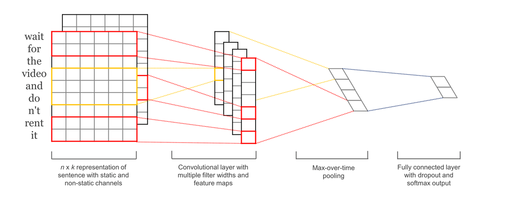
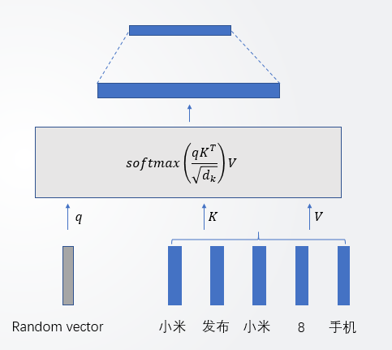

## 事件识别与分类模型实现与应用 — tonyzhu的暑期实习总结

6月23号入职，8月22号离职，这两个月的实习，能够切实感受到自己的成长，这里总结下自己这两个月所做的工作，一方面是用于回顾总结，另一方面也希望对看到这篇文章的人有一定的帮助。

### 1. 任务描述

入职第一天，rocky就给我布置了实习期间的任务，那就是给定新闻标题，判断该新闻是否在描述一个事件，在描述什么事件。简言之就是做一个新闻标题的事件分类模型。

其实这个任务是事件抽取任务的一个子任务，先来看一下什么是事件抽取：

> 事件抽取（ACE2005定义）：**识别特定类型的事件**，并进行相关信息的确定和抽取。

我要做的任务就是上述加粗字体的内容，这里需要了解一些概念：

- Event trigger：触发词，即最能表明该事件发生的词语
- Event argument： 事件参与实体，如时间、地点、人物等

结合以下例子食用更佳：

以上句子描述了一个*婚礼*事件，“婚礼”这个词为该事件的触发词。模型的任务就是给出上述标题文字，给出该标题在描述的事件类别。

其实事件抽取这个任务还是挺难的，因为还要抽取 argument，但作为事件抽取的子任务，事件识别与分类可以简单当做一个分类模型来做，我这里就是当做分类任务来做的。

### 2. 数据相关

没数据是个大问题。曾经的我因为这个事情很苦恼，后来决定自己标注数据。自己动手，丰衣足食~

- 首先是数据出库，我使用6月27和6月28两天的QQ看点的科技领域的数据进行出库。我这里的数据和模型都是针对**科技领域**的，这是因为不同领域的事件类别和词向量及一些trick都不太一样，所以是分领域进行的。

- 在标注之前，我通过观察数据，将科技领域的事件类别分为 {投/融资、发布产品、合作、上市、发布消息、人员变动、其他事件、非事件} 8 个类别。

- 接下来写了个 python 脚本进行了标注，标注信息包括是否是事件、是的话触发词是哪个词、是什么事件。在标注的过程中，我发现了几个问题：

  1. 有些标题判断起来比较模糊，自己主观上认为标注为事件和非事件都可以；
  2. 有些标题标注为事件后，触发词的标注也比较模糊，要么是无法判定哪个是触发词，要么是触发词可能无法被分词分出来；
  3. 有些标点符号如叹号冒号等，对识别一个标题是否为事件有一定影响

  最终一共标注数据 4962 条，平衡正负样本后选取了 1582 条数据作为训练数据（包括训练集和验证集）

- 实体匿名化，这里主要参考了这篇[KM文章](http://km.oa.com/group/17516/articles/show/336361)的处理方式。即将人名和机构名分别替换为“PER”和“ORG”;

- 分词使用的是内搜平台部的 QQSeg 分词组件，一是因为其分词效果要比 jieba 好（自己主观感觉），二是因为后续上线的话用不了 jieba 。但 QQSeg 的命名实体识别功能有一定缺陷，在使用过程中我也向内搜那边提交了不少坏例，主要坏例如：

  ​	华为联同海康威视，在工业互联网领域深入合作

  QQSeg 会将 联同海康威视 这6个字识别为一个机构名。由于实体匿名化的处理，所以实体的识别效果还是有一定影响的。

- 标点符号处理：前面说了有些标点符号对于分类来说是一个不错的特征，所以就保留了标点，并将各个标点符号统一为英文标点；

- 词向量训练：训练语料使用了 TDW 里 QQ 看点所有科技领域的标题，一共 50+w 条；同样做了实体匿名化处理，同时将词频 <= 3的词替换为UNK，用做 OOV词语的词向量。最后使用 Fasttext 进行训练。

### 3. 模型相关

前面说了，我是将该问题作为分类问题做的，所以用的模型也都是分类模型。这里一共实验了三个模型，接下来一一说一下。

#### 3.1 TextCNN

TextCNN 是一个用于文本分类的经典模型，这里作为 baseline 来实验。TextCNN 模型结构如图所示：

因为我的数据量不大，因此只使用了 Static-Channel，即使用预训练的词向量，且词向量不随着训练过程而改变；filter size 使用原论文数据 【2，3，4】，同样由于数据量小，filter 的数量只取了20，其余参数和原论文相同，包括 dropout 和 L2 正则化。

该参数组合下，模型表现见下表：

|          | P     | R     | F     |
| -------- | ----- | ----- | ----- |
| 科技领域 | 0.782 | 0.803 | 0.792 |

后来将参数改为 filter size = 1, num_filters = 100，结果如下：

|          | P     | R     | F     |
| -------- | ----- | ----- | ----- |
| 科技领域 | 0.853 | 0.858 | 0.856 |

其实后者类似去拿一个一个的 filter 去匹配触发词，在我标注数据的过程中，发现我标注的数据中，绝大部分标题的事件都是和某些关键词绑定在一起的。所以匹配关键词确实也能做到不错的准确率，但最终带来的结果是严重的过拟合。即标题中只要有某个关键词，模型就会把它判断为相应的事件，这并不是我们希望看到的。

#### 3.2 Attention相关模型

接下来的两个模型都用到了 Attention 机制，因此先简单介绍一下 Attention 机制的原理。

Attention 机制的想法来源于我们人类的注意力机制，比如在翻译一段英文时，如 *Knowledge changes life* ，我们可以快速翻译为 *知识改变命运*，但想一下，我们在翻译 *知识* 这个词的时候，脑袋里肯定是给予 *Knowledge* 这个词最大的关注的，同样，翻译 *改变* 这个词的时候，肯定是主要使用 *changes* 这个词的信息 。Attention 机制就是如此，在不同地方，使用不同词语不同分量的信息。那么 Attention 机制是怎么做到上面的步骤呢？

其实 Attention 的本质是 query、key 和 value 的函数，即：
$$
AttentionVector = f(query, (key, value))
$$
具体计算方法见下图：

一共三大步：

1. 计算 query 与 key 的相似度，得到注意力权重；
2. 使用 softmax 对权重进行归一化；
3. 权重与相应 value 进行加权求和得到 Attention Vector；

还是拿上文的翻译举例。比如在翻译 *知识* 时，我们拿表征*知识* 这个词的向量作为 query 向量， *Knowledge*、*changes*、*life* 作为 keys 和 values （有三个(key，value)对，key = value），上述三大步翻译成大白话如下：

1. 计算 *知识* 这个词和 *Knowledge*、*changes*、*life* 这三个词的相似度： a1, a2, a3;
2. 把上述相似度映射到(0,1)，且满足 a1+a2+a3 = 1;
3. 最后的结果是 a1 * w_knowledeg + a2 * w_changes + a3 * life

OK，Attention介绍完毕。接下来看一下具体怎么应用到事件识别与分类上。

##### 3.2.1 基于词分类的 Attention 模型

这个模型其实是完全参考的这篇[KM文章](http://km.oa.com/group/17516/articles/show/336361)，这里非常感谢作者 @forestliu 的文章以及在此期间给予的帮助。

有了上面 Attention 模型的理解，接下来就很好解释了，先上图形：

同样举例来解释，对于文本 【我    在    打字】建模为词分类的任务。首先构造样本为：
$$
（我， 【在    打字】，非事件）
$$

$$
（在， 【我    打字】，非事件）
$$

$$
（打字，【我    在】， 打字事件）
$$

即一个样本由候选触发词和其上下文组成，只有真正触发词的样本会被标记为相应事件。模型可以看做是将候选触发词作为 query，上下文词语们作为 keys 和 values，去计算 Attention Vector。将该向量与候选触发词的词向量进行拼接，然后接全连接层进行分类。

结果如下表所示：

|          | P     | R     | F     |
| -------- | ----- | ----- | ----- |
| 科技领域 | 0.862 | 0.683 | 0.762 |

##### 3.2.2 基于句子分类的 Attention 模型

这个模型的想法来源于在看上述方法的论文时的思考，当时觉得 Attention 模型用在这个任务中确实是有效的，但数据标注实在麻烦而且困难，一是由于需要标注触发词，工作量比较大，二是标注时触发词的判定比较困难，三是标注的触发词不一定会被分词工具给分出来。所以我就在思考，能否不使用触发词，单纯地使用 Attention 机制去分类。

想法有了，接下来就是思考如何做，还是 query、key 和 value 的思路。首先，要使用 Attention 机制，当前文本肯定是要作为 key 和 value 的，那么 query 向量怎么办？ 没有思路。。。 还好，后面看到了这篇论文：[Hierarchical Attention Networks for Document Classification](https://www.cs.cmu.edu/~hovy/papers/16HLT-hierarchical-attention-networks.pdf) ，里面的分层 Attention 使用的是随机初始化的向量作为 query 向量。和我现在的情况很像，于是我就使用了随机初始化的向量作为 query 向量去做 Attention 计算。上图形（忽视我拙劣的画技）：

同样是三步走战略，中间那个简洁的公式其实就包含了上面介绍的三个步骤。得到 Attention Vector 之后直接进行分类就行了。它的直观理解可以参考下面的图（同样忽略我拙劣的PPT画技）：

即从各个词语中各取一些信息（不等量），然后做分类。效果见下表：

|          | P     | R     | F     |
| -------- | ----- | ----- | ----- |
| 科技领域 | 0.823 | 0.836 | 0.829 |

#### 3.3 模型选择

虽然基于句子分类的 Attention 模型，在验证集上的表现略逊于 filter_size 为 1 的 TextCNN，但后者有非常严重的过拟合，且前者参数数量（1358个参数）比后者（15808）少一个数量级，所以最终我选择了使用前者。

模型效果举例如下：

1. 腾讯联同京东投资唯品会，协同互补成关键词                        >>> 合作事件
2. 拼多多回应假货：假一赔十                                                       >>>发布消息事件
3. 高通布局未来智能物联芯片市场宣告失败                                >>>其他事件
4. 我们以后可能真的坐不到滴滴网约车了                                    >>>非事件
5. OPPO R17横空出世，科技感爆棚，超乎你想象                      >>>发布产品事件
6. 科美生物完成20亿私募股权融资                                               >>>投/融资事件
7. 四川全面检查融资担保行业：严重违规将被吊销牌照             >>>其他事件
8. 潘石屹谈融资：我们不缺钱 我怕管别人的钱                           >>>非事件

其中序号8的文本，由于过拟合，TextCNN会预测为 投/融资 事件。

#### 3.4 其他

关于 3.2.2 中的模型，在同事 leonyue 的指点下，也尝试了在单层 Attention 模型上，再进行一次更高层次的 Attention 计算（Attention Vector 作为 query 向量，key 和 value 不变），但效果略微变差。但我觉得这个想法应该是有用的。因为 3.2.2 的模型其实是存在一个问题的，因为参数数量很少，所以数据量增加时可能会出现欠拟合，进行多层的 Attention 可以增加参数数量，防止欠拟合。但由于没有时间再标注更多数据，所以这点也没有去验证。

### 4. 工程相关

工程这一块，主要是使用 C++ 实现了模型的前向传播，基于 http 协议，做成 SPP 微线程服务，可以供他人调用，自己也基于这个又做了一个小网页，用于接受输入框内容并判断事件类别，同时将同一类别的新闻标题放到一起，以表格形式展示出来。

由于以前没写过 C++，也没做过前后端，所以这一块做的很慢，而且大都是边看同事的代码边写的。所以这一块其实我能写的也不多，各位看官随便看看就好。

### 5. 致谢

回顾这两个月，我个人感觉自己学到了很多。从刚开始 rocky 布置任务时的不知所措，到一步步拆解问题，一步步解决问题，基本上是从零走通了一个任务从找数据到训练模型到模型应用的整个流程。既巩固了以前学到的但掌握不牢的知识，也学到了很多新知识，锻炼了工程能力。

真的非常感谢我的同事 leonyue，这两个月基本上一直是他在带我，也经常(beipo)帮我找代码里的 bug 。非常喜欢 leon 看待模型的角度和思路：想方设法去解释深度学习模型，我也从这种思路中加深了对模型的理解。leon 真的非常厉害，是我的小偶像~

很感谢我的 leader rockyjiang，从入职第一天就帮我明确了实习期间的任务，除此之外没有其他杂活，能够让我专心投入去学习和探索，看得出来，rocky 是真的关注实习生的成长而不是让实习生来承担脏活累活的，这一点真的很感谢。同时，组内分享会上，rocky 的业务思维也让我受益匪浅。从自学技术开始，我的思维就一直是技术思维，即得到问题，解决问题。而对于业务部门来说，光有技术思维是不够的，技术如何应用到业务上并有产出，这也是值得经常思考的。

此外，这两个月和组内的大家一起吃自助、吃海鲜、爬山、打农药，真切地感到，我们开发五组，人又帅（美）性格又好能力还贼强，能来到这里实习，真的很棒！

